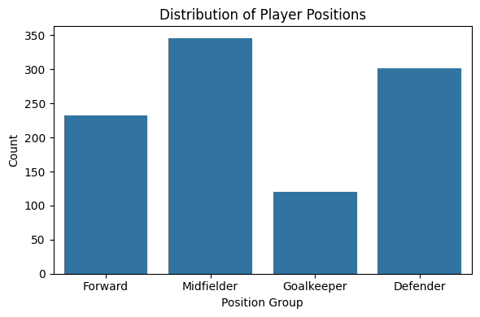
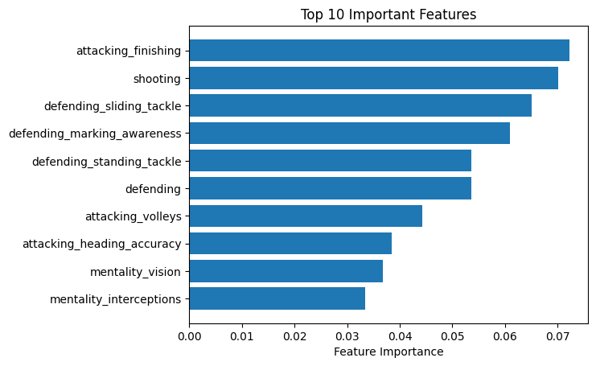
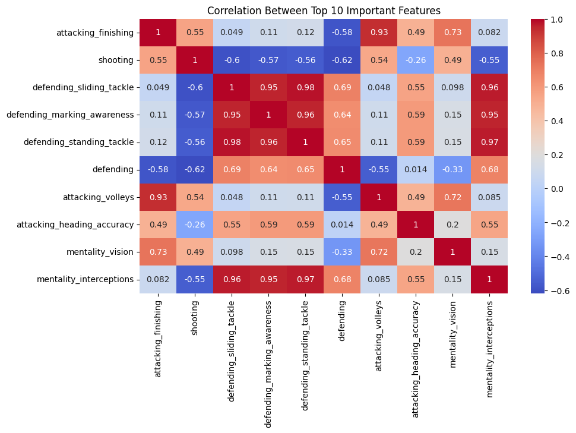
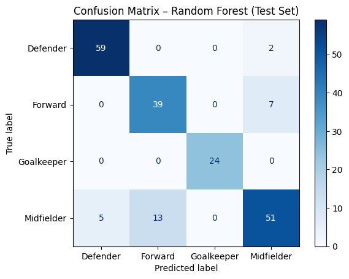

# Player Position Classification

This repository presents a machine learning solution for classifying soccer players into one of four primary position groups (Goalkeeper, Defender, Midfielder, Forward) based on their in-game attributes.

## Overview

The objective is to build a supervised classification model that predicts a player's position group using numerical and categorical features representing technical, physical, and mental skills. The dataset was cleaned and processed by removing missing values, encoding categorical features, and standardizing numerical columns. Two classification models were implemented and evaluated — Random Forest and Logistic Regression. Model performance was assessed using accuracy, confusion matrices, and classification reports. Random Forest yielded the highest classification accuracy across all player roles.

## Summary of Work Done

### Data

- **Type**: Tabular CSV dataset with player statistics.
  - **Input**: 83 numerical and categorical features (e.g., short passing, standing tackle, vision, work rate, preferred foot).
  - **Target**: One of four position groups — Goalkeeper, Defender, Midfielder, Forward.
- **Size**: ~18,000 player entries.
- **Split**:
  - Training set: ~10,800 players (60%)
  - Validation set: ~3,600 players (20%)
  - Test set: ~3,600 players (20%)

### Preprocessing / Clean-Up

- Columns with high missing values (e.g., goalkeeper-specific stats for non-GKs) were dropped.
- Categorical columns such as `preferred_foot` and `work_rate` were one-hot encoded.
- Numerical features were scaled using `StandardScaler` for Logistic Regression.
- Final dataset used 84 features with no missing values.

### Data Visualization

**1. Distribution of Position Groups**  

**2. Top 10 Most Important Features (Random Forest)**  

**3. Feature Correlation Heatmap (Top Features)**  

### Problem Formulation

- **Input**: Player performance attributes (e.g., passing accuracy, agility, strength).
- **Output**: Predicted player position group.
- **Models**:
  - Random Forest Classifier (default scikit-learn parameters)
  - Logistic Regression (with scaled features, `max_iter=1000`)
- **Evaluation Metrics**:
  - Accuracy
  - Precision, Recall, F1-score
  - Confusion Matrix

### Training

- **Environment**:
  - Python 3, Jupyter Notebook
  - Libraries: `pandas`, `scikit-learn`, `matplotlib`, `seaborn`
- **Hardware**: MacBook, local environment
- **Training Duration**: Under 2 minutes per model

Models were trained using the training set, validated on the validation set, and evaluated on the test set to ensure generalizability.

### Performance Comparison

| Model               | Validation Accuracy | Test Accuracy |
|---------------------|---------------------|---------------|
| Random Forest       | 0.89                | 0.88          |
| Logistic Regression | 0.88                | 0.875         |

**Confusion Matrix — Random Forest (Test Set)**  

### Conclusions

Random Forest outperformed Logistic Regression slightly, particularly in classifying Goalkeepers and Forwards. The model generalized well to unseen data and maintained strong class-wise F1 scores. Logistic Regression performed well for Defenders and Midfielders but showed confusion in other roles.

### Future Work

- Test advanced models like XGBoost or LightGBM for further performance gains.
- Tune hyperparameters such as `max_depth`, `n_estimators` for Random Forest.
- Incorporate contextual features (e.g., club position, league tier, nationality).
- Explore multilabel or probabilistic classification for hybrid role players.

---

## How to Reproduce Results

### Data

The cleaned dataset is embedded within the notebook. It is a processed subset of the publicly available EA FC/FIFA player dataset.

### Training and Evaluation

Run the `Zewdie_PlayerPosition.ipynb` notebook to reproduce the full pipeline, including:

- Data Cleaning and Encoding
- Exploratory Visualizations
- Model Training (Random Forest, Logistic Regression)
- Evaluation with confusion matrices and classification reports

---

## Repository Contents

- `Zewdie_PlayerPosition.ipynb`: Complete project notebook.
- `README.md`: This file.
- `confusion_rf.png`: Random Forest confusion matrix.
- `correlation_heatmap.png`: Feature correlation heatmap.
- `top10_features.png`: Top features by importance.
- `position_distribution.png`: Target class distribution.

---

## Citations

- EA Sports / FIFA Dataset via Kaggle  
- scikit-learn Documentation  
- University of Texas at Arlington — Data Science Course Materials
